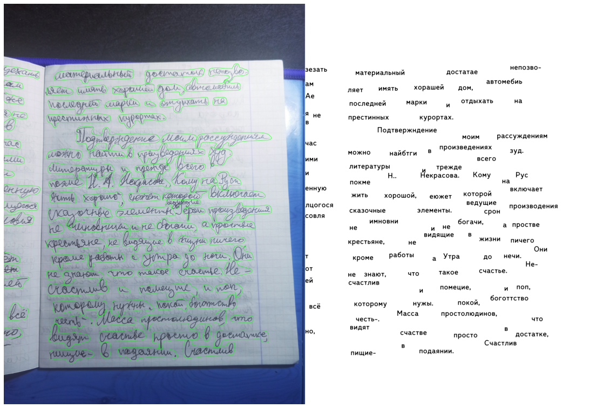
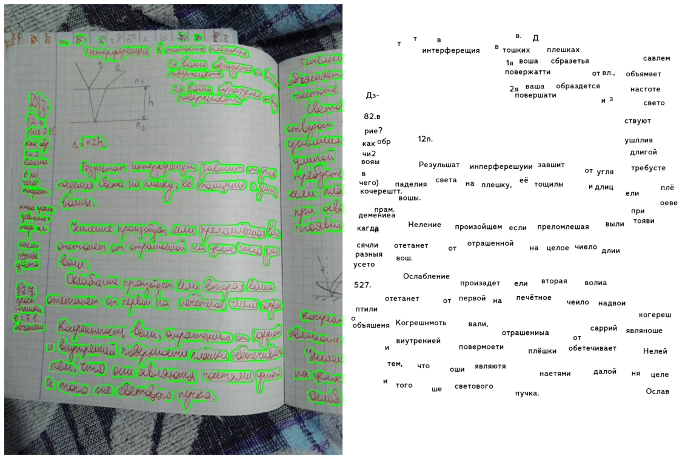

# NTO AI Handwritten character recognition

## Overview
The task is to recognize handwritten words \
from notebooks of students in two languages:
* English
* Russian

## Methods
We used `Detetron2` to segment the words \
and `CRNN` to recognize the words.

## Results

| example 1| example 2 |
| :------: | :-------: |
|  |  |
